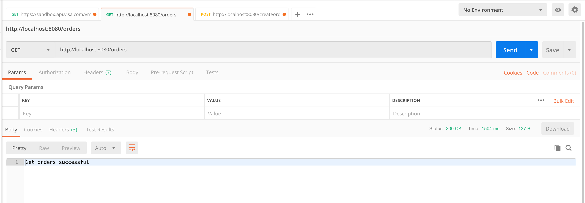

# Tracing

## Overview
This application set uses open tracing to instrument a java spring boot app and sends trace logs to Jaeger. The example shows testing the appliction on a local machine as well as in Kubernetes
 - Observability: 
   Monitoring related data made available from the applications and other components. If observability is not built-in, data should be gathered by traditional ways.

 - Monitoring:
   Collects, aggregates and displays observability data.

 - Analysis: 
   Automatic or manual analysis of collected monitoring data to instrument and take actions.

The  microservice application AccountServices contains a get and a post method , it internally calls the OrderServices microservice. The application is written to introduce latency in the method calls to understand trace flows.


### Jaeger
 - Distributed transaction tracing
 - Root cause Analysis
 - Service dependency analysis
 - Performance / latency optimization
 - Natively supports Opentracing
 - Exposes Prometheus metrics by default
 - Distributed transaction monitoring


## Instrument the Spring boot application

1.1 The  microservice application AccountServices contains a get and a post method , it internally calls the OrderServices microservice. The application is written to introduce latency in the method calls to understand trace flows.

1.2 The build.gradle file has all the necessary imports required imports for jaeger , and prometheus

1.3 Make modifications to the SpringBoot class AccountMgrApplication for example and imclude the below 

```code
@Bean
	public RestTemplate restTemplate(RestTemplateBuilder restTemplateBuilder) {
		return restTemplateBuilder.build();
	}

@Bean
	public io.opentracing.Tracer getTracer()  {
		Configuration config = Configuration.fromEnv();
	    return config.getTracer();  
	}
```

Code on Controller

```code
@Autowired
	  private RestTemplate restTemplate;
```

</details>
<br/>


1.4 Run Jaeger locally as a docker container 
Note: Make sure docker is installed. 

```bash
docker run -d --name jaeger \
  -e COLLECTOR_ZIPKIN_HTTP_PORT=9411 \
  -p 5775:5775/udp \
  -p 6831:6831/udp \
  -p 6832:6832/udp \
  -p 5778:5778 \
  -p 16686:16686 \
  -p 14268:14268 \
  -p 9411:9411 \
  jaegertracing/all-in-one:1.8
```

1.5 Access Jaeger on http://localhost:16686

1.6 Run the spring boot app and pass the following variables as environment variables

```bash
-DJAEGER_SERVICE_NAME=myaccounts -DJAEGER_SAMPLER_TYPE=const -DJAEGER_SAMPLER_PARAM=1 -DJAEGER_REPORTER_LOG_SPANS=true -DORDERMGR_URL=http://localhost:9090
```

1.7 Install postman or any http client. You could also use curl for the same. Invoke the orders get operation

<details><summary>Screenshot 1.7</summary>

</details>
<br/>


1.8 Invoke the createorder post operation 

<details><summary>Screenshot 1.8</summary>

</details>
<br/>

Input json

```json
{
	"accountID": "test",
	"accountDescp": "hello",
	"sku": "12345",
	"orderQuantity": 2
}

```

1.9 Introduce an error by invoking failaccount get operation

<details><summary>Screenshot 1.9</summary>

</details>
<br/>


1.10 View trace log in Jaeger. You will notice both the account and order service show up in jaeger

<details><summary>Screenshot 2.0</summary>

</details>
<br/>

1.11 View trace log in Jaeger.

<details><summary>Screenshot 1.11</summary>

</details>
<br/>


<details><summary>Screenshot 1.11.1</summary>

</details>
<br/>

## Containerization 

2.1 Create a docker image. A dockerfile is provided with each product that containerizes the image. Run the following command to create a docker image from the directory where the docker file exists.

Note: Build the project using gradle clean build

```bash
docker build --tag accountservice .
and
docker build --tag orderservice .
```

2.2 Check if your docker images are created

```bash
docker images
```
<details><summary>Screenshot 2.1.1</summary>

</details>
<br/>

2.3 Tag and push image to a repository. Here we are pushing it to docker hub.  is my public repo.

```bash
docker tag orderservice:latest  <repo>:orderservicev7
docker tag accountservice:latest  <repo>:accountservice:v7

docker push <repo>:accountservice:v7
docker push <repo>:orderservice:v7

```

## Deploy code to Kubernetes

3.1 Follow the [PKS Ninja Observability Guide](https://github.com/CNA-Tech/PKS-Ninja/tree/master/LabGuides/PksAppsObservability-AO1706) for Kubernetes specific directions.


